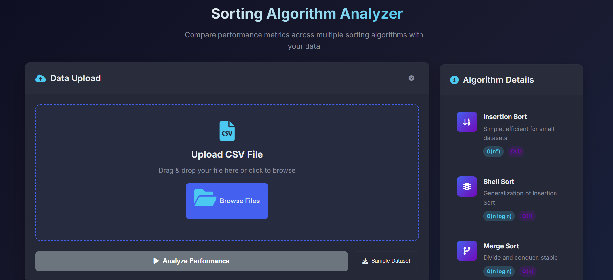
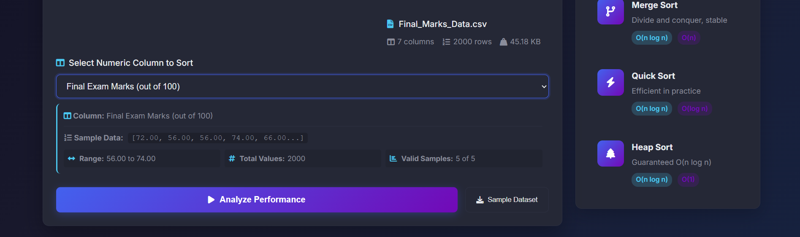
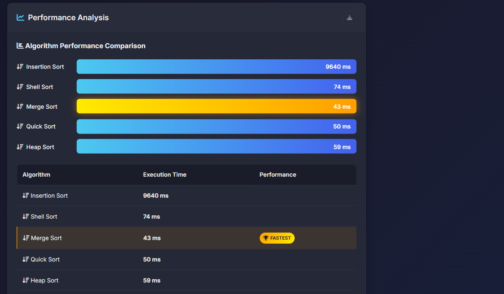

# Java Sorting Algorithm Performance Evaluator

[](https://www.java.com/)
[](https://developer.mozilla.org/en-US/docs/Web/HTML)
[](https://developer.mozilla.org/en-US/docs/Web/JavaScript)

---

## 📖 Overview

This is a **group assignment project** developed as part of the **University of Colombo, Faculty of Technology** curriculum.  

The project allows users to:  
- Upload a **CSV dataset**  
- Select a **numeric column** to sort  
- Apply multiple **sorting algorithms**  
- Evaluate **performance** using execution time  
- Identify the **best-performing algorithm**  

The assignment also includes a **recorded presentation** where each member explains their contribution and demonstrates the application.

---

## 🎯 Objective

The main goal of this assignment is to create a **Java-based application** that demonstrates the **implementation and performance analysis of sorting algorithms**:

1. File upload and CSV parsing  
2. Column detection and selection  
3. Sorting using multiple algorithms: **Insertion Sort, Shell Sort, Merge Sort, Quick Sort, Heap Sort**  
4. Performance evaluation with execution time measurement  
5. GUI interface for easy user interaction  

---

## 💡 Features

### Dataset Upload
- Drag-and-drop or file input for CSV files  
- Automatic detection of numeric columns  
- File statistics: number of columns, rows, and file size  
- Validation for proper CSV format and non-empty files  

### Sorting Algorithms
- **Insertion Sort**  
- **Shell Sort**  
- **Merge Sort**  
- **Quick Sort**  
- **Heap Sort**  

### Performance Evaluation
- Measures execution time of all algorithms  
- Identifies the **fastest algorithm**  
- Displays results in **interactive charts and tables**  

### User Interface
- **GUI-based** for easy interaction  
- Column selection via dropdown  
- Data preview before sorting  
- Loading indicators and error messages  

---

## 🛠 Technologies Used

| Layer | Technology |
|-------|------------|
| Backend | Java (ServerSocket, multi-threading) |
| Frontend | HTML, CSS, JavaScript |
| Tools | VS Code, IntelliJ IDEA |
| Dataset | CSV files (sample datasets from Kaggle) |

---

## 📂 Project Structure
```yaml
project-root/
│
├── backend/
│   ├── SortServer.java     # Main server for sorting logic and execution timing
│   └── TestServer.java     # Test server for verifying basic connectivity
│
├── frontend/
│   ├── index.html          # Main GUI (HTML5 structure)
│   └── main.js             # Core JS: CSV parsing, API requests, and UI logic
│
├── README.md               # Project documentation
└── sample-dataset.csv      # Sample CSV for immediate testing
```

---

## ⚙️ Installation & Setup

### Prerequisites
* **Java 8** or higher installed.
* A modern **Web Browser** (Chrome, Firefox, or Edge).
* Active internet connection (to load visualization libraries if applicable).

### Steps
1.  **Clone the Repository**
    ```bash
    git clone <repository_url>
    ```
2.  **Open the Project**
    Open the root folder in your preferred IDE (IntelliJ IDEA, WebStorm, VS Code).
3.  **Start the Backend**
    Navigate to the `backend` folder and run:
    ```bash
    java SortServer.java
    ```
4.  **Launch the Frontend**
    Open `frontend/index.html` in your web browser.
5.  **Run Analysis**
    Upload a CSV, select your numeric column, and click "Analyze."

> [!TIP]
> You can download professional datasets for testing from [Kaggle](https://www.kaggle.com/datasets).

---

## 🚀 Usage
1.  **Upload:** Use the "Upload" button to select your `.csv` file.
2.  **Select:** Choose the numeric column you wish to sort from the dropdown menu.
3.  **Analyze:** Click **Analyze Performance** to trigger the backend sorting.
4.  **View:** Results will appear in a table and chart format, highlighting the "Best Performing Algorithm."

---

## 👥 Group Members & Contributions

| Member | Tasks |
| :--- | :--- |
| **Member 1 (2021t01258)** | CSV parsing & column extraction, Backend request handling, Merge Sort implementation, Execution time API completion. |
| **Member 2 (2021t01223)** | Heap Sort implementation, Shell Sort implementation, Frontend (basic structure & core functionality), Testing Part 2. |
| **Member 3  (2021t01228)** | Quick Sort implementation, Insertion Sort implementation, Frontend (advanced features & enhancements), Testing Part 2. |
| **Common Tasks** | Final bug fixes, documentation, error handling, and presentation prep. |

---

## 📸 Project Screenshots

#### 1. File Selection
*The user selects the target CSV dataset from the local file system.*
<br>


#### 2. Column Selection & Analysis Initialization
*The system detects available columns; the user selects a numeric column to begin the performance test.*
<br>


#### 3. Sorting Analysis Results
*Real-time execution timing for all five algorithms (Insertion, Shell, Merge, Quick, and Heap Sort).*
<br>


#### 4. Best Algorithm Identification
*The application concludes by highlighting the most efficient algorithm based on the lowest execution time.*
<br>


---

## 📌 Notes
* **Column Selection:** Always ensure you select **numeric columns** for sorting to avoid calculation errors.
* **Input Validation:** The system is designed to handle invalid data and empty CSV inputs gracefully.
* **Mandatory Presentation:** A recorded presentation is **required** to demonstrate and verify individual code contributions.

---

## 🔗 References
* **Kaggle Datasets:** [Explore Datasets](https://www.kaggle.com/datasets)
* **Sorting Algorithm Concepts:** Standard computer science textbooks and online documentation.
* **Java Socket Programming:** [Oracle Java Documentation](https://docs.oracle.com/javase/tutorial/networking/sockets/index.html)

---

> [!IMPORTANT]
> Ensure the **SortServer.java** is running before attempting to upload or analyze data via the frontend.


